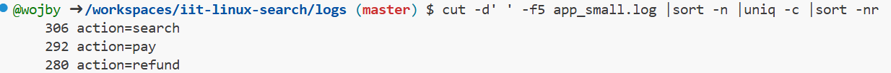
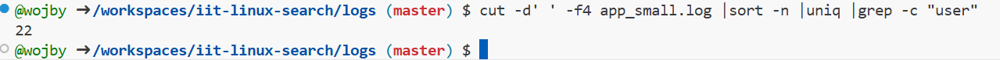

> This is the demonstration how to use Linux commands to process strutured text data.

### 0. How many lines are in fullnames_with_age.txt?

Put screenshot from Codespaces illustrating the result here.
Correct screenshot should contain your github username in the shell, a command and the result.

Example:

**Explanation** Write the explanation why the specific command was used.

wc (word count) command is counting data in the file. -l tells wc to output counted lines.

Example: wc command is to count data in a given file. -l parameter is for counting lines.

### 1. How many lines in access_small.log have path /login?

Put screenshot from Codespaces illustrating the result here.
Correct screenshot should contain your github username in the shell, a command and the result.

**Explanation** Write the explanation why the specific command was used.

grep (Global Regular Expression Print) filter lines that contain a pattern. -c tells grep to count the number of lines.

---

### 2. How many different ages are in fullnames_with_age.txt?

Put screenshot from Codespaces illustrating the result here.
Correct screenshot should contain your github username in the shell, a command and the result.

**Explanation** Write the explanation why the specific command was used.

cut is used to extract sections from each line. -d specifies which delimiter is used. -f3 says that 3rd column is where the program should look. sort -n sorts numerically. uniq filters adjacent matching lines. wc -l count how many unique ages are there.

---

### 3. How many unique first names are in fullnames_with_age.txt?

Put screenshot from Codespaces illustrating the result here.
Correct screenshot should contain your github username in the shell, a command and the result.

**Explanation** Write the explanation why the specific command was used.

cut is used to extract sections from each line. -d specifies which delimiter is used. -f1 says that 1st column is where the program should look. sort -n sorts numerically. uniq filters adjacent matching lines. wc -l count how many unique ages are there.

---

### 4. Which age is most frequent in fullnames_with_age.txt?

Put screenshot from Codespaces illustrating the result here.
Correct screenshot should contain your github username in the shell, a command and the result.

**Explanation** Write the explanation why the specific command was used.

cut is used to extract sections from each line. -d specifies which delimiter is used. -f3 says that 3rd column is where the program should look. sort -n sorts numerically. uniq filters adjacent matching lines and -c counts occurences. sort -nr sorts in reverse order, so the most frequent age is on shown top.

---

### 5. Which username failed login most often in auth_small.csv?

Put screenshot from Codespaces illustrating the result here.
Correct screenshot should contain your github username in the shell, a command and the result.

**Explanation** Write the explanation why the specific command was used.

grep is used to filter lines that contain FAIL. cut is used to extract sections from each line. -d specifies which delimiter is used. -f2 says that 2nd column is where the program should look. sort sorts. uniq filters adjacent matching lines and -c counts occurences. sort -nr sorts in reverse order, so the most frequent username is shown on top.

---

### 6. How many lines in system_small.log have ok=true?

Put screenshot from Codespaces illustrating the result here.
Correct screenshot should contain your github username in the shell, a command and the result.

**Explanation** Write the explanation why the specific command was used.

grep is used to filter lines that contain ok=true. -c is used to count those lines.

---

### 7, Which level (INFO, WARN, ERROR) appears most often in system_small.log?

Put screenshot from Codespaces illustrating the result here.
Correct screenshot should contain your github username in the shell, a command and the result.

**Explanation** Write the explanation why the specific command was used.

cut is used to extract sections from each line. -d specifies which delimiter is used. -f2 says that 2nd column is where the program should look. sort -n sorts numerically. uniq filters adjacent matching lines and -c counts occurences. sort -nr sorts in reverse order, so the most frequent result is on top.

---

### 8. What is the top 3 most common actions in app_small.log?

Put screenshot from Codespaces illustrating the result here.
Correct screenshot should contain your github username in the shell, a command and the result.

**Explanation** Write the explanation why the specific command was used.

cut is used to extract sections from each line. -d specifies which delimiter is used. -f5 says that 5th column is where the program should look. sort -n sorts numerically. uniq filters adjacent matching lines and -c counts occurences. sort -nr sorts in reverse order, so the most frequent results are on top.

---

### 9. How many unique users are in app_small.log?

Put screenshot from Codespaces illustrating the result here.
Correct screenshot should contain your github username in the shell, a command and the result.

**Explanation** Write the explanation why the specific command was used.

cut is used to extract sections from each line. -d specifies which delimiter is used. -f4 says that 4th column is where the program should look. sort -n sorts numerically. uniq filters adjacent matching lines. grep -c counts and outputs the number of the lines that contain user.

---